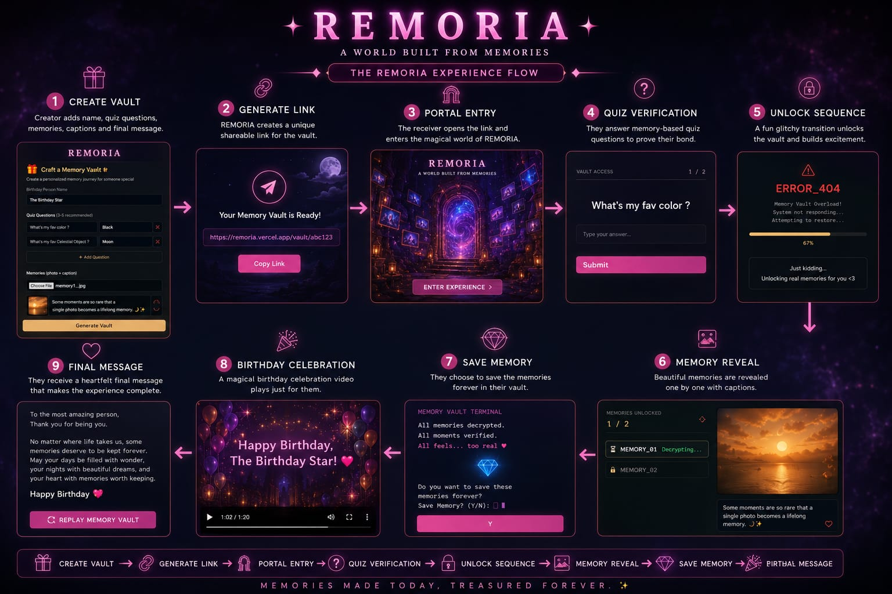
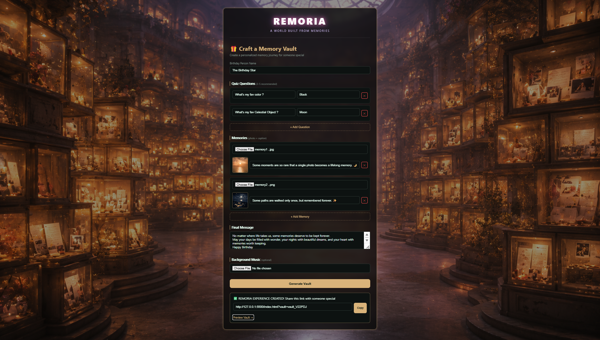
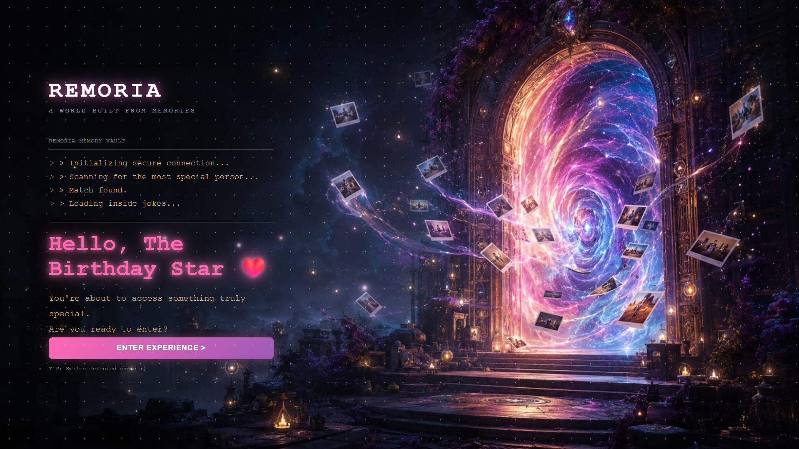
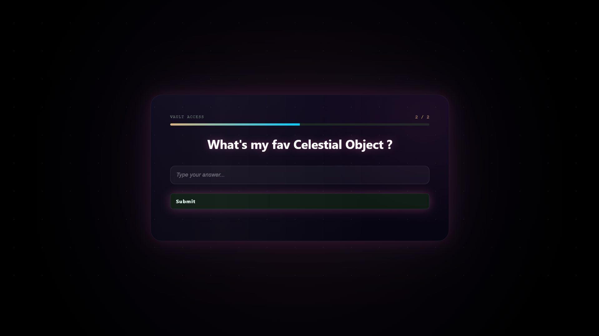
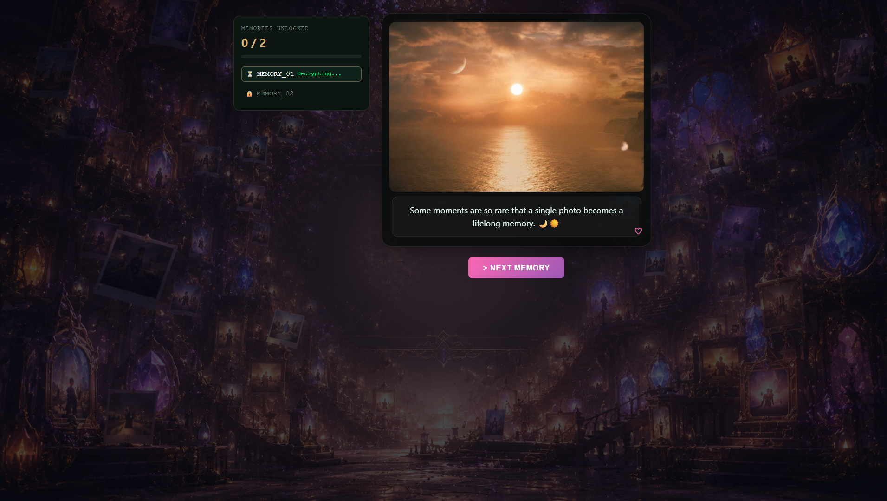
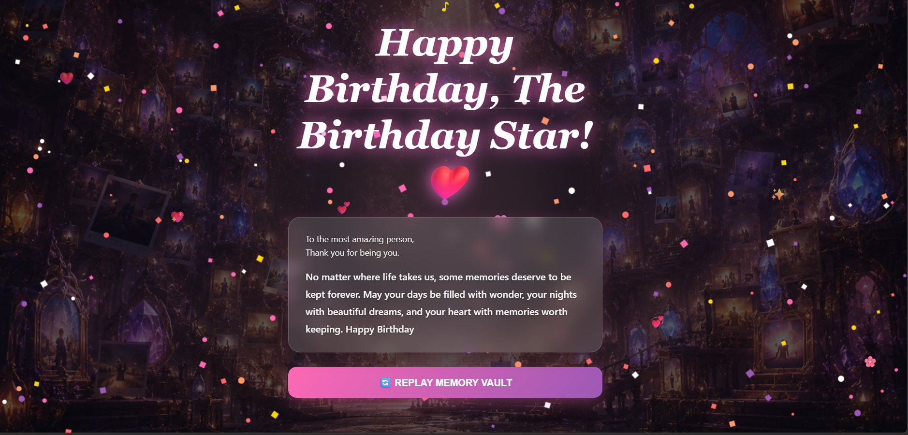

# 💎 REMORIA — A World Built From Memories

> *Memories aren't meant to be stored. They're meant to be experienced.*

REMORIA is an immersive web experience that transforms a simple birthday wish into an unforgettable interactive memory journey.

Instead of sending a traditional greeting, REMORIA allows creators to build a personalized Memory Vault filled with quiz questions, treasured photos, heartfelt captions, and a final birthday message. The recipient unlocks memories one by one before reaching a magical birthday celebration.

---

# ✨ Inspiration

Most digital birthday wishes are forgotten within minutes.

REMORIA was built around a simple question:

**What if a birthday gift wasn't just seen... but experienced?**

The result is a cinematic web experience where memories become the gift.

---

# 🌐 Live Demo

🔗 **Live Website:** https://remoria-bay.vercel.app

> **Best Experience:** Optimized for desktop and laptop browsers.
> Mobile devices are supported, and landscape mode is recommended for the best cinematic experience.

---

# 🌟 Features

- 🎁 Personalized Memory Vault Creator
- 🔗 Unique Shareable Vault Link
- 🌌 Cinematic Portal Entry Experience
- ❓ Interactive Quiz Verification
- ⚡ Glitch Unlock Animation
- 🖼 Progressive Memory Reveal
- ☁️ Cloud-Based Memory Vault Storage (Firebase Firestore)
- 🌍 Cross-Device Shareable Memory Links
- 🎉 Magical Birthday Celebration
- 💌 Heartfelt Final Message
- 🎵 Optional Background Music

---

# 🛠 Tech Stack

- HTML5
- CSS3
- JavaScript (ES6)
- Firebase Firestore
- Git & GitHub
- Vercel Deployment
- Responsive UI Design
- Glassmorphism
- Cinematic Visual Design
- Interactive Animations

---

# 🏗 Architecture

Creator Page
↓
Firebase Firestore
↓
Shareable Vault Link
↓
Portal Verification
↓
Memory Timeline
↓
Birthday Celebration
↓
Final Message

---

# 🔄 Experience Flow

---

# 🖼 Project Screenshots

## 🎁 Memory Vault Creator

---

## 🌌 Portal Entry

---

## ❓ Quiz Verification

---

## 🖼 Memory Reveal

---

## 💌 Final Message

---

# 🎯 Project Highlights

- Emotion-driven storytelling
- Interactive birthday experience
- Fantasy-inspired UI/UX
- Cinematic transition
- Personalized memory sharing
- Responsive design
- Modern frontend implementation
- Firebase Cloud Database Integration
- Real-time Shareable Memory Vaults
- Live Deployment on Vercel

---

# 🚀 Future Improvements

- User authentication
- AI-generated birthday messages
- Multiple themes
- Music library integration
- QR code sharing
- Mobile-first optimization
- Password-protected Memory Vaults
- Email-based Memory Vault Sharing

---

# 💙 Project Philosophy

> Not every gift comes in a box.

> Some are hidden behind memories.

**REMORIA transforms birthday wishes into unforgettable experiences.**

---

## 👨‍💻 Developed By

**Shaik Madhar Baba**

B.Tech in Computer Science & Engineering (AI & ML)

---

⭐ If you enjoyed REMORIA, consider giving this repository a star!

💻 Best experienced on Desktop & Laptop browsers.
📱 Mobile devices are supported, with landscape mode recommended for the optimal cinematic experience.
